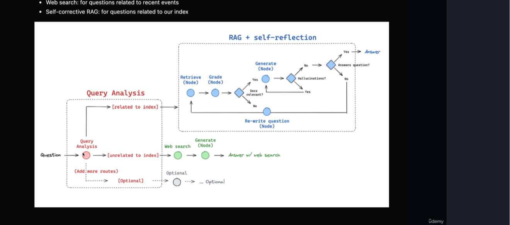

# Adaptive-RAG
This project is a question-answering system that integrates document retrieval, web search, and language generation using OpenAI's GPT models. The system assesses whether the generated answers are grounded in relevant documents and whether they accurately address the user's question.

# Question Answering System with Document Retrieval and Generation

This project is a question-answering system that integrates document retrieval, web search, and language generation using OpenAI's GPT models. The system assesses whether the generated answers are grounded in relevant documents and whether they accurately address the user's question.

## Features

- **Web Search**: Retrieves relevant documents from specified web pages.
- **Document Retrieval**: Retrieves documents from a local vector store.
- **Answer Generation**: Uses a language model (GPT) to generate answers.
- **Hallucination Grading**: Evaluates whether the answer is grounded in the retrieved facts.
- **Answer Grading**: Evaluates whether the answer addresses the question effectively.

## Project Structure

Workflow Overview
Ingestion (ingestion.py): Loads and splits documents from a list of URLs. These documents are processed into smaller chunks for easier retrieval.

Graph Workflow (graph.py): Directs the question to the appropriate process (web search, document retrieval, or generation). It assesses if the question requires web search or if it can be answered using pre-retrieved documents.

Answer Generation (generation.py): Uses a language model (GPT-4) to generate answers to the question based on the input documents.

Hallucination Grading (hallucination_grader.py): Checks whether the generated answer is grounded in the retrieved documents.

Answer Grading (answer_grader.py): Evaluates whether the generated answer effectively addresses the question.

